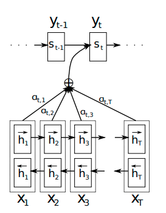
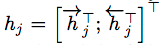
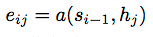
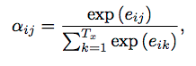
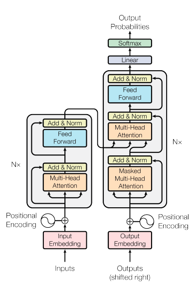
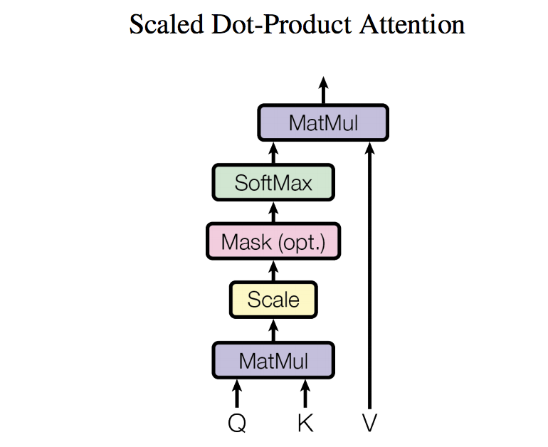
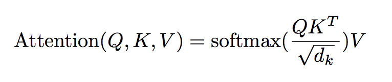
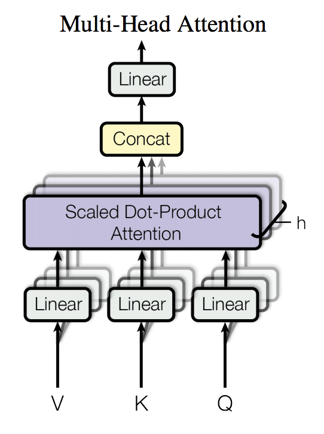
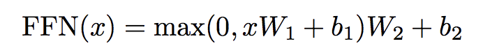
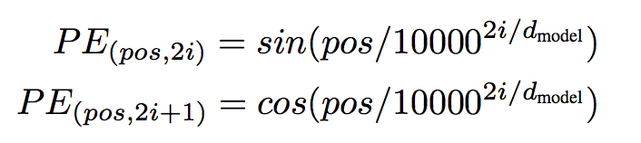

[*<<返回主页*](../index.md)  
**本文为作者原创，转载请注明出处** 
### 深入浅出Attention和Transformer
本文介绍attention机制和基于attention的transformer模型。网上关于这两者的博客很多，但大都照搬论文，千篇一律，不够深入和通俗，本文在参考这些博客和原始论文的基础上，加入自己的理解，深入且通俗的讲解attention和transformer。 
#### Attention in RNN
Bengio等人在2014年[Neural machine translation by jointly learning to align and translate](https://arxiv.org/abs/1409.0473)中提出Attention机制。  
传统的RNN在t时刻的输入是h(t-1)和x(t)，encoder在最后时刻输出一个针对input sequence的特征表示，decoder在生成output sequence时输入该特征表示和上一时刻的解码结果。在长句子翻译任务中，decoder并不关心input sequence的整个句子，而只关心input sequence的某一些局部特征，因此Bengio等人提出Attention机制，学习input sequence和output sequence的对齐(Align)和翻译(Translate)关系，在编码过程中，将原句子编码成特征向量的集合，在解码时，每个时刻会从该特征集合中选择一个子集用于生成解码结果。模型结构如下图所示： 
 
##### Encoder
Encoder采用双向RNN结构，每个时刻的隐层输出是前向rnn隐层和后向rnn隐层的拼接，即  
 
这样，j时刻的特征表示就包含了整个句子（前向和后向）的信息，而每个时刻均有一个特征表示，从而构成输入序列的特征表示集合。 
##### Decoder
如果说encoder跟传统seq2seq结构并没有本质上的区别的话，Decoder跟传统seq2seq则发生了本质变化，这也是Attention机制的精华所在，即在Decode时同时学习对齐模型(align model)和翻译模型(translate model)。 
###### 对齐模型
对齐模型学习的是输入时刻j和输出时刻i的匹配关系alpha(i,j)，j与i匹配程度越高，alpha(i,j)值越大，表示如下：
 
 
其中，Si-1是decoder在i的上一时刻的输出，hj是encoder在j时刻的隐层拼接，a是前馈神经网络，alpha(i, j)是i时刻在时刻j上的概率分布，表示为softmax的输出。 
##### 翻译模型
翻译模型即解码过程，以encoder输出、decoder上一时刻解码结果、对齐模型输出为输入，输出当前时刻的解码结果，模型表示如下： 
 
 
 
Ci是encoder隐层的加权和，其中权重就是对齐模型的输出，Si和Si-1是decoder当前时刻和上一时刻的隐层输出，yi和yi-1是decoder当前时刻和上一时刻的解码结果。 
#### transformer
目前主流的序列转换模型采用复杂的CNN或者RNN结构来构建encoder和decoder，若加上连接encoder和decoder的attention机制后，模型效果得到了进一步提升。但这些模型由于存在记忆约束(memory constraint)，因此无法跨样本并行训练，导致训练时间较长，虽然目前有一些工作(factorization trick 或 conditional computation)可以很大程度上提升计算效率，但由序列的限制依然存在，或者诸如ConS2S/ByteNet等使用CNN抽取序列的隐藏特征表示，但是这些模型很难学习长距离的依赖。transformer抛弃了encoder和decoder中的RNN或CNN结构，只单纯的采用attention机制，提升训练速度的同时拥有更好的性能。 
##### 模型结构
###### Encoder and Decoder Stacks
 
上图是transformer的模型结构，可以分为encoder（左边）和decoder（右边）两部分。  
encoder的输入层是Input Embedding和Positional Encoding的和（向量相加），特征抽取层是由N个结构相同的层堆叠而成（上图最左边的Nx表示了堆叠结构），下面层的输出作为上面层的输入，直到最后一个层的输出才作为decoder的输入（中间层的输出不作为decoder的输入）。每个子层由Multi-Head Attention和Feed Forward两个子层组成，另外还可以看到有Add&Norm的结构单元，这个其实就是对两个子层的输出的标准化，表示为LayerNorm(x + Sublayer(x))，关于Multi-Head Attention/Feed Forward/LayerNorm和Positional Encoding等细节稍后祥述。  
decoder的输入层也是Output Embedding和Positional Encoding的和，特征抽取层也是由N个结构相同的层堆叠而成（最右边的Nx表示了这种堆叠结构），除了下面层的输出作为上面层的输入外，encoder的输出也会作为每一层的输入（注意：每一层都要把encoder的输出作为输入，其实也不难理解，因为每层结构一样，如果哪一层不把encoder的输出作为输入，那每层的内部结构就不一样了），最后一层的输出经过一个线性层，最后分类。decoder内部由一个相比encoder来说独有的Masked Multi-Head Attention单元，这个单元主要是为了不让decoder看到当前解码结果之后的信息。 
##### Attention结构
[Attention Is All You Need](https://papers.nips.cc/paper/7181-attention-is-all-you-need.pdf)这篇论文中提到过很多与attention相关的名词，初看论文时会被这些attention的概念和关系迷惑，本文首先对这些attention做一个梳理。  
Scaled Dot-Product Attention(比例点乘attention)是transformer中最基本的attention结构，Multi-Head Attention(多头attention)是多个并行的Scaled Dot-Product Attention，把每个Scaled Dot-Product Attention的输出拼接并做线性转化后（线性转化的目的主要是为了是的输出的维度与Scaled Dot-Product Attention保持一致）输出，self-attention本质是Multi-Head Attention，只不过Multi-Head Attention的输入均是来自seqence本身（均来自input sequence或者均来自output sequence），encoder-decoder attention本质也是Multi-Head Attention，不过encoder-decoder attention的输入有来自encoder的（或者说来自input sequence的），而不是只源于decoder的（或者output sequence的），Masked Multi-Head Attention是在Scaled Dot-Product Attention的结构中加入了mask单元，以防止在解码时访问到当前位置之后的信息，本质上是加了mask的Multi-Head Attention。  
1）比例点乘attention  
 
上图是比例点乘attention的网络结构，输入是Q/K/V的矩阵，Q/K/V矩阵均是由input经过projection层得到的，即Q = IWq，K= IWk, V = IWv，I的size为(input_sequence_len, embedding_size)，Wq的size为(embedding_size, dk)，Wv的size为(embedding_size, dv)，经过projection层就把输入转换成了三个不同的矩阵Q/K/V，其中Q(query)表征了输入特征，K(key)表征每个token的权，与Q经过点乘attention后用来表征每个V的相对权重，V则表征token的值。后上述网络结构用公式表示如下： 
 
Q与K的转置相乘其实就是每个token的q向量（所有token的q向量合在一起形成了Q矩阵）分别与每个token的k向量（所有的token的k向量合在一起形成了K矩阵）做点乘，得到size为(input_sequence_len, input_sequence_len)的矩阵，QKT的每一行表示的就是所有token在当前token的权重，而softmax作用在QKT的每一行，就是对这些权重以行为单位做归一化，归一化后的值就可以表针各个token对当前输出的权重大小，最后在和V相乘其实就是对每一个V加权，达到attention的目的。最后输出的size为(input_sequence_len, dv)。  
而比例点乘attention中的"比例"就体现在dk上（除以一个常数），论文中提到使用比例的原因是因为当dk较大时，Q与K相乘的结果很大，导致softmax的梯度很小，除了一个dk可以增加梯度。  
网络中还有一个Mask(opt.)单元，是一个可选单元，加上这个单元后Multi-Head Attention即变成了Masked Multi-Head Attention，用在decoder中防止在解码时访问到当前位置之后的信息，而在Encoder中不需要这个单元。  
2）多头attention  
 
论文还发现使用多个并行的比例点乘attention效果更好，也就是上图的多头attention(Multi-Head Attention)。与单头attention一样，同样需要经过projection层将input sequence embedding转换成Q/K/V，只不过同样的project操作进行h = 8次（8头attention），每个project操作有自己不同的参数矩阵。8个不同的Q/K/V输入到8个单头attention网络中，得到8个(input_sequence_len, dv)的输出，将这8个输出拼接起来，然后经过一个线性层，使得最后的输出size与输入(input_sequence_len, dmodel)保持一致（这样才能在Add&Norm子层执行加的操作）。  
多头attention的dk/dv分别减小为单头attention的1/h倍，所以多头attention的计算量其实与单头attention一样，但是多头attention模型更复杂，能建立更复杂的attention关系，每个头的输入表征了input sequence embedding的不同子空间，最终使得多头模型效果更好。 
##### 前馈网络
transformer层包括Feed Forward子层，即前馈网络层，前馈网络对每个token(或position)来说是一模一样的，参数也一样，所以这一层可以看做是一个kernel size为1的卷积层。具体来说Feed Forward是两个ReLU子层，输入和输出的size均为dmodel，而两个隐层size为2048。公式表示如下：
 
##### 输入和输出
Encoder和Decoder的输入均是经过预训练的embedding矩阵转换而来的，每个token的对应dmodel维的embedding向量，由前馈网络的输出可以Encoder的输出也是dmodel维，而在Decoder输出层，模型并没有去重新学习一个linear层，而是复用了预训练的embedding矩阵（实际上是embedding矩阵的转置），将Decoder的输出转化vacab_size，最后经过softmax分类。  
由上述网络结构可以看出，各个token之间其实是无序的，也就是说可以把输入看做是一个集合，而不是一个序列，而真正的输入是一个有序序列，因此需要对输入的相对和绝对位置关系进行建模，即在Encoder和Decoder的输入加入position embedding（矩阵相加）。论文尝试了使用模型去学习position embedding，也尝试了直接固定position的特征，发现两者差距不大，固定的position embedding表示如下： 
 
pos表示token的位置，i表示position embedding的维度，针对不同的维度，各个pos构成了周期不同的正弦波(周期2pi到1000\*2pi)，由于sin(pos +k) = cos(k)sin(pos) + sin(k)cos(pos)，即位置(pos+k)的postion embeding 可以表示为位置pos的线性加权，因此论文认为这种positon embedding建模了相对位置关系，实际实验也验证了这一点。 
#### 参考文献
[Neural Machine Translation by Jointly Learning to Align and Translate](https://arxiv.org/abs/1409.0473)
[Attention in RNN](https://zhuanlan.zhihu.com/p/42724582)
[Attention Is All You Need](https://papers.nips.cc/paper/7181-attention-is-all-you-need.pdf)
[The Illustrated Transformer](http://jalammar.github.io/illustrated-transformer/)

