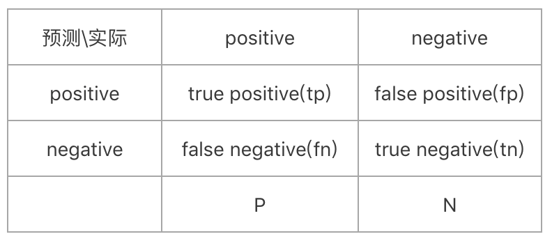

[*<<返回主页*](../index.md)  
**本文为作者原创，转载请注明出处** 
### 机器学习一般流程总结
前段时间总结了下机器学习的一般流程，经过一番梳理后，写成博客，与大家分享。  
机器学习一般包含这5个步骤:数据获取、特征提取、模型训练和验证、线下测试、线上测试。 
#### 数据获取
首先从线上拉取用户真实数据，用现有模型过一遍这些数据得到一些有用的信息作为标注人员的一个参考，加快标注速度；
标注完成后，数据入库并解决冲突，冲突即是同一个query，两次标注结果不一致，解决冲突的办法一般是人工check，得到一个更准确的标注； 
#### 特征抽取
NLP任务一般需要抽取数据的特征，如ngram、词典特征、词向量特征、上游模块的输出等。
一般离线和在线均需要特征抽取，所以离在线的这部分代码是共用的，避免在线特征抽取和离线不一致。
抽取特征时有个小技巧是把能想到的特征均抽取出来，并保存成文本文件，避免重复的执行特征抽取的步骤，在实验的时候用mask的方式去屏蔽掉不生效的特征，因为针对神经网络这样的模型，值为0的特这个一般不影响最终结果（如tanh/ReLU等，但sigmoid激活层可能会影响）。  
抽取出来的特征一般还不能满足机器学习框架的要求，通过脚本转化成机器学习框架要求的格式即可。 
#### 模型训练和验证
常用的模型训练和验证步骤是：首先以一个简易的算法开始，快速的进行实现，并在交叉验证集上进行验证；
然后画出它的学习曲线，通过学习曲线确定是否更多的数据或者更多的特征会对模型的优化有帮助。
接着人为地检测交叉验证集中被错误的进行分类的或者预测的样本的共同特征，从实际入手对模型进行调整，即Error Analysis，不断调整并验证在交叉验证集上的误差，寻找最优的结果，优化模型。 
##### 模型训练
模型训练是机器学习任务中最重要的一步，包括模型结构设计、模型超参数调整等。此处不展开讲解。 
##### 模型验证
常用的模型验证方法有hold-out validation(训练集-验证集二划分)和cross-validation(交叉校验)  
1）hold-out validation  
hold-out validation交叉验证假设数据集中的样本独立同分布，在划分训练集和验证集时随机按一定比例（如7:3）划分即可。模型在训练集上训练，在验证集上计算性能指标并验证效果。  
hold-out validation比较简单，可以快速实现，快速看到模型方案的效果，缺点是强假设性，训练出来的模型的泛化能力不够强，验证集的数据量要够大。  
2）cross-validation  
cross-validation首先将数据集随机地划分成数量相同的k份，然后依次使用其中的k-1份进行模型训练，剩下的1份进行模型验证，这样就得到了k个指标，计算这k个指标的平均值作为模型指标。如果模型指标符合预期，则可以将训练集和验证集合并，所有数据集作为训练集共同训练一个模型。  
模型验证时需要计算模型在训练集和测试集上的指标，一般包括:loss、accuracy、eer等。
loss就是模型训练时指定的损失函数、目标函数或者似然值；accuracy就是模型在正负例上的准确率（与精确率区分）；eer(equal error rate)是等错误率，即正例上的错误率和负例上的错误相等的时候的错误率，也是整体的错误率，这个指标与AUC类似，是一个与正负例比例无关的指标，当正负例比例相差较大时，使用eer/AUC指标比较合理。  
模型验证完成后有时可能还需要滑阈值，滑阈值是根据业务需求，调整正负例上的准确率，如果模型验证中eer有提升，那么滑阈值后模型性能一定也有所提升。 
#### 线下测试
线下测试是指在模型验证有提升后，在测试集上测试模型的性能指标。
线下可以可以将模型集成在应用程序里测试，也可以单独测试模型。
线下测试的指标一般跟具体的业务需求相关，包括：准确率(accuracy)、精确率(precesion)、召回率(recall)、F1值等。 
 
混淆矩阵表示如上，从这个混淆矩阵中可以计算准确率、精确率、召回率、F1等指标。  
accuracy = (tp + tn) / (N + P) 
precision = tp / (tp + fp) 
recall = tp / (tp + fn) = tp / P 
f1 = 2 * precision * recall / (precison + recall) 
如果是多分类问题（如，领域分类等），上述accuracy/precison/recall/f1指标仍然适用。
具体来说，在所有的数据上可以计算accuracy，即所有正确分类的数量占总数据量的比例；
而precison/recall/f1都是针对每个类别分别计算的，针对类别l，tp对应预测为l且标注为l的数量，fp对应预测为l标注为其它类别的数量，fn对应预测为其它类别标注为l的数量，根据上述公式即可计算出每个类别的precison/recall/f1指标。 
#### 线上测试
线上测试是模型上线后的测试，是跟业务紧密相关的一个指标。在实际工作中，一般先将版本上线至一个复制小流量环境，打到这个环境的流量同时也打到线上环境，
然后同时取出线上环境的结果和复制小流量环境的结果，抽出两者的diff，人工做gsb(good bad same)，即针对有diff的case，人工标注小流量好(good)，还是线上好(bad)，或者两者打平(same)，如果good多于bad，说明gsb通过，可以上线供用户体验。这种方法与A/B testing类似。  
模型上到线上后，可以通过用户行为反馈模型的好坏，如用户点击、pv等。 
#### 总结
以上就是本文总结的机器学习的一般流程，都是作者从工作中总结出的实际经验，可能不够详细也不够完整，但可以作为机器学习初学者的一个参考，随着作者工作的深入，上述步骤也会逐步完善和修正。 
### 参考文献
[机器学习模型评价(Evaluating Machine Learning Models)-主要概念与陷阱](https://blog.csdn.net/heyongluoyao8/article/details/49408319)
