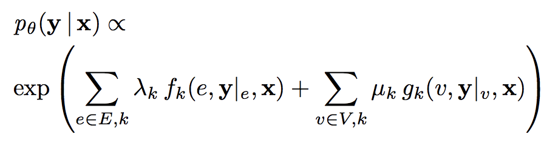
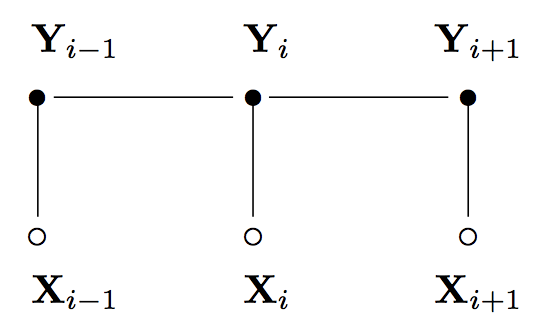
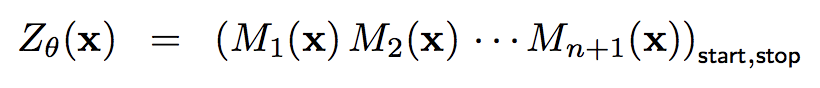
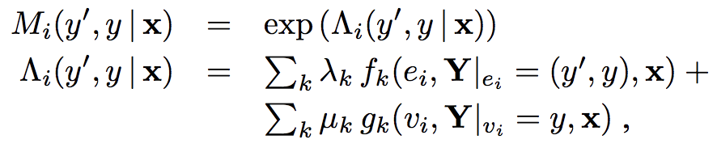
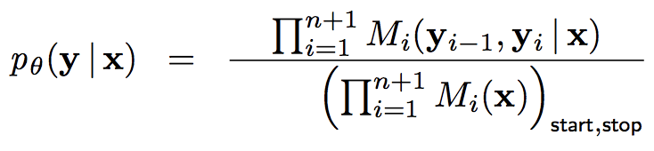
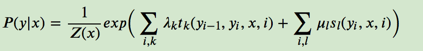
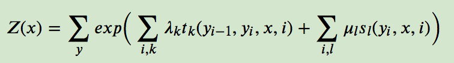
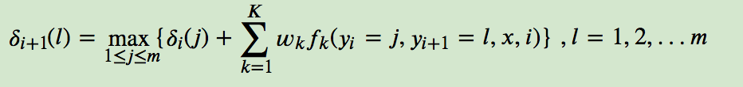
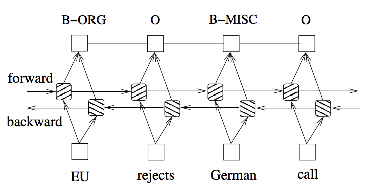
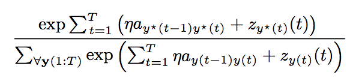

[*<<返回主页*](../index.md)  
**本文为作者原创，转载请注明出处** 
### 序列标注之Bi-LSTM+CRF
本文讲解序列标注任务。  
序列标注是自然语言处理的基本任务，包括词性标注、中文分词、槽位识别等。
例如，在中文分词任务中，模型为每个字打上s/b/m/e等标签，分别表示单字成词、词语起始字、词语中间字、词语结尾字，将标签b/m/e结合起来就成了一个中文词，而s则单独分成一个中文词。  
解决序列标注问题常用的方法有HMM、MEMM、CRF、LSTM等，目前工业上比较成熟的方案是Bi-LSTM+CRF，
2018年google提出了BERT作为预训练词向量模型，其具有比Bi-LSTM更强的特征学习能力，因此现在很多公司也在尝试使用BERT+CRF做序列标注任务，
但BERT+CRF需要大量的预训练语料，且由于模型体积比较大，在部署的时候存在推理时间慢的问题，因此本文主要讲解Bi-LSTM+CRF的方案。 
#### CRF
Lafferty等人在2001年的[Conditional Random Fields: Probabilistic Models for Segmenting and Labeling Sequence Data](http://repository.upenn.edu/cgi/viewcontent.cgi?article=1162&context=cis_papers)中提出CRF，
CRF在POS（词性标注）任务中战胜了HMM和MEMM，从此开启了CRF在序列标注任务中的统治地位。  
CRF是一个判别式模型，因此模型要建模的是条件概率，即P(Y|X)，其中X是输入序列（比如中文文本），Y是标注序列（比如槽位标签），根据随机场理论，P(Y|X)可以表示如下： 
 
其中，fk和gk分别是边特征函数和节点特征函数，这些特征函数一般是事先定义好的（与分类任务中事先定义好使用哪些特征一样），
gk只与当前位置的输入和标签有关，在线性链CRF中，fk只与当前位置的标签和上一时刻的标签有关，
lambdak和uk分别表示边特征函数和节点特征函数的权重，是模型要学习的参数。线性链CRF的图结构表示如下： 
 
上式关于P(Y|X)的建模只是一个正比例关系，要用作真正的计算，还需要对上式做归一化处理，归一化的分母则是所有可能的Y的乘积，表示如下： 
 
其中Mi(X)是给定观察序列X，第i个位置的得分矩阵，矩阵的行和列分别表示上一个位置和当前位置的label的取值，Mi(X)公式表示如下： 
 
归一化后的P(Y|X)表示如下： 
 
对上式取对数后，可得到： 
 
其中，归一化因子Z(x)表示为： 
 
##### 参数估计
CRF参数估计准则是最大似然准则，优化方法可采用梯度下降或者拟牛顿法，实际求解过程中定义了与HMM类似的前向变量和后向变量。
具体求解方法可以参考[条件随机场CRF(二) 前向后向算法评估标记序列概率](https://www.cnblogs.com/pinard/p/7055072.html)，此处不详细介绍。 
##### 解码
CRF解码算法与HMM一样，都是采用维特比算法，解码过程中与参数估计中不一样的地方在于，不用考虑归一化因子，因为归一化因子不影响结果的大小比较，维特比算法的递推公式表示如下： 
 
关于解码算法更详细的讲解参考[条件随机场CRF(三) 模型学习与维特比算法解码](https://www.cnblogs.com/pinard/p/7068574.html)，此处不详细介绍。 
#### Bi-LSTM + CRF
由于RNN或LSTM处理序列数据时，可以在每个时刻输出一个label，因此RNN或LSTM结构天生就是解决序列标注问题的好手，但是RNN和LSTM有个问题是，label之间互相没有约束，而类似POS、槽位标注等任务的label序列之间存在严格的约束，
比如POS任务中，动词后面不能再接动词，因此需要在RNN或LSTM的输出层加上CRF，利用RNN/LSTM提取序列特征，利用CRF建模序列级别的损失，并引入label之间的约束关系。  
Bi-LSTM + CRF的结构表示如下： 
 
Bi-LSTM的输出作为CRF的输入，并作为节点特征函数的score，CRF模型要学习的参数只有边特征函数的权重，Bi-LSTM+CRF中的P(Y|X)表示为： 
 
其中，序列[y*(1), y*(2), y*(3),..., y*(T)]是标注结果。
Bi-LSTM + CRF的参数估计方法与CRF一样，都可以采用极大似然估计的优化准则，优化方法可以采用梯度下降，
只是梯度回传到Bi-LSTM的时候要继续在Bi-LSTM里回传，优化LSTM的参数。  
Bi-LSTM + CRF的解码算法跟CRF也一样，采用维特比算法，只不过节点特征函数的score来自Bi-LSTM的输出。 
#### 总结
Bi-LSTM + CRF由于引入了双向长短依赖的结构，使其能更好的抽取序列特征，而CRF结构本身可以在句子级别上计算损失，
能约束label之间的关系，Bi-LSTM和CRF两者的结合作为序列标注任务的模型，比单独的CRF或LSTM效果都要好。 
#### 参考文献
[Conditional Random Fields: Probabilistic Models for Segmenting and Labeling Sequence Data](http://repository.upenn.edu/cgi/viewcontent.cgi?article=1162&context=cis_papers)  
[条件随机场CRF(一)从随机场到线性链条件随机场](https://www.cnblogs.com/pinard/p/7048333.html)  
[条件随机场CRF(二) 前向后向算法评估标记序列概率](https://www.cnblogs.com/pinard/p/7055072.html)  
[Recurrent Conditional Random Field for Language Understanding](https://www.researchgate.net/publication/266798174_Recurrent_Conditional_Random_Field_for_Language_Understanding)  
