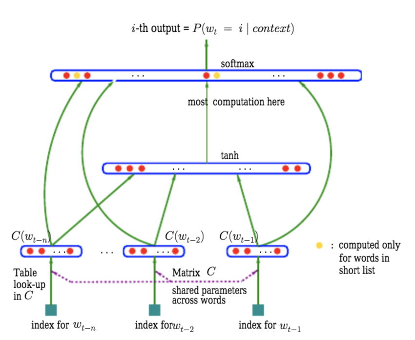
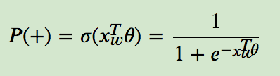
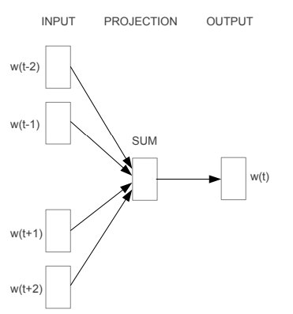
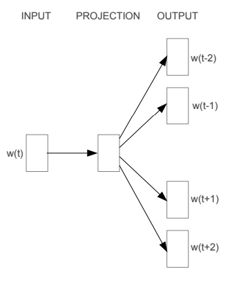
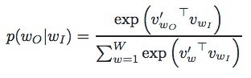
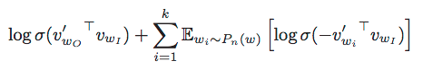

[*<<返回主页*](../index.md)  
**本文为作者原创，转载请注明出处** 
## 预训练词表示之word2vec(一)
本系列讲解NLP任务中的词表示(word representation)方法。  
词表示就是用连续(continuous)、稠密(dense)、低维度(low-dimension)的向量表示词的特征，有别于传统nlp任务中使用的one-hot、ngram、tf-idf等特征，词表示是一种用连续浮点数表示的向量，具有稠密、维度低的特点，而传统特征太过于稀疏，且无法有效表达词与词之间的关系(语义相似性、句法关系等)，不利于模型学习；良好训练的词向量可以作为神经网络的输入，神经网络结合词与词之间的依赖关系得到句子的特征，最后完成文本分类、序列转换等机器学习任务。有人也把词向量表示叫做词嵌入(word embedding)，也就是把词嵌入向量空间，用数学的方法将自然语言中的词表示出来。  
本文首先讲解word2vec基本原理，后续还会讲解GloVe、ELMo、GTP和BERT等。 
### word2vec
word2vec是google在2013年的[Efficient Estimation of Word Representations in Vector Space](https://arxiv.org/abs/1301.3781v3)提出并开源的，在word2vec提出来之前，Bengio等人使用前馈神经网络训练语言模型(NNLM)，同时得到了词向量。还有人首先利用单隐层神经网络训练词向量，然后利用词向量训练语言模型，word2vec的思想就来源于此，但word2vec之关注词向量，不再继续训练语言模型了。 
#### 前馈神经网络语言模型和RNN语言模型
前馈NNLM的结构表示如下： 
 
前馈NNLM的输入是当前词之前的n个词的index（可以理解成每个词的one-hot编码），n个词经过一个共享权重的projection layer后就得到一个nxD维的矩阵（每个词用D维向量表示），然后经过一个tanh激活的隐层，输出层softmax的每一位代表一个词。前馈NNLM的计算量很大，主要表现在两个方面：  
1）projection layer和tanh layer之间的非线性层，计算量很大；  
2）softmax层有V个输出，V表示词表大小，是个很大的数。  
有人提出在输出层使用分层softmax，可以使输出层的计算单元减小到log2(V)，因此主导计算复杂度的就变成了projection layer与tanh layer之间的非线性连接，而word2vec直接抛弃了tanh层，主导计算复杂度的结构又回到了输出层。  
相比前馈神经网络，循环神经网络(RNN)在处理序列问题上具有天然的优势，可以不用指定n的大小，而且可以学习到更复杂的依赖关系，因此将前馈神经网络替换成RNN可以提升模型性能。为了减小计算量，RNN语言模型依然需要使用分层softmax作为输出。 
##### 分层softmax
word2vec使用了哈夫曼树作为输出层，哈夫曼树是平均长度最小的编码树，因此输出层的计算量也是最小的。word2vec论文中还比较了哈夫曼树和平衡二叉树的复杂度，结论是哈夫曼树比平衡二叉树快两倍左右。  
分层softmax结构表示如下： 
 
叶子节点表示输出词，输入词从根节点沿着某一条路径到达输出词节点，经过的每一个内部节点就相当于神经网络的一个隐层，这些隐层的激活函数都是sigmoid函数，其输入都是输入词的词向量，输出就是当前路径，沿着左子树走，sigmoid层的输出为负例，沿着右子树走，sigmoid层输出正例，因此分层softmax将一个V分类问题转化成了log2(V)个二分类问题。每个sigmoid层的输出表示为： 
 
其中xw是输入词向量，theta是当前sigmoid层的参数（类似逻辑回归的模型参数），xw和theta都是在训练过程中需要被优化的模型参数，theta参数是在所有输出词之间共享的，即只要哈夫曼编码的前缀有重叠，编码路径上的theta参数就是共享的。如果当前路径为右子树（正例），损失函数为-log(P(+))，如果当前路径为左子树（负例），损失函数为-log(1 - P(+))，路径上的损失函数相加就是当前样本的损失，使用随机梯度下降算法即可训练输入词向量和theta参数。  
### CBOW和Skip-gram
word2vec与之前训练词向量方法的不同点在于：1）word2vec只专注于训练词向量，不关注如何使用词向量训练语言模型；2）word2vec不再使用隐层激活，只有input、projection和output层。word2vec进一步简化了词向量的训练，能在更大规模的数据上更高效的训练。  
CBOW(Continuous Bag Of Words)结构如下： 
 
CBOW使用上文N个词和下文N个词作为输入，经过projection层后直接输出，其中projection层与前文NNLM一样，都是各输入词之间共享权重的，只不过CBOW模型将projection层的2N个输出相加并取平均，output层依然采用分层softmax。CBOW模型的计算复杂度为：Q = N x D + D x log2(V)，其中D为词向量维度。  
CBOW模型的输入是无序的，即上下文的顺序对词向量的训练无影响，这与Bag of Words模型相似，但Bag of Words的输入特征是稀疏且不连续的，而CBOW的输入是上下文的连续(continuous)词向量。CBOW将上下文词向量相加取平均后作为输入，梯度回传至输入层时将梯度平均分配给各个输入词，这样不能区别对待上下文的各个词（每个词的梯度一样）。  
Skip-gram模型以中心词为输入预测上下文词，且每次只预测一个词，每一个(中心词，上下文词)的pair组成一个训练样本，因为中心词和及其上下文词互为上下文关系，所以Skip-gram模型也可以认为是以上下文的某一个词为输入，预测中心词。Skip-gram的模型结构如下： 
 
Skip-gram的计算复杂度为 Q = C x (D + D x log2(V))，其中C是上下文窗口的大小，窗口内的每个pair都要计算一次。相距越远的词之间的依赖关系越弱，将这些pair作为训练语料获得的收益越小，因此论文中随机取R个上下文词，其中 1 < R < C。  
从论文实验结果看，Skip-gram和CBOW在句法(syntatic)相似度任务上效果基本持平（CBOW略胜一筹），但在语义(semantic)相似度任务上，Skip-gram大幅领先CBOW模型，因此Skip-gram得到更广泛的应用。 
### Negative Sampling
原始softmax输出层的概率计算公式为： 
 
其中vw和vw'分别表示词w的输入词向量和输出词向量，也就是说同一个词w有两个词向量，分别为输入词向量vw和输出词向量vw'，由前文分析可知，这个概率的计算复杂度很高，不利于大数据集上训练。上文的分层softmax可以将输出层的计算维度从V减小到log2V，但如果每个词的词频很低，其编码长度较长，计算复杂度也比较高。output层除了可以使用分层softmax之外，还可以使用负采样的方法，google第二篇关于word2vec的论文[Distributed Representations of Words and Phrases and their Compositionality](https://papers.nips.cc/paper/5021-distributed-representations-of-words-and-phrases-and-their-compositionality.pdf)提出了该方法。  
负采样(NEG)方法源于NCE(Noise Contrastive Estimation)，NEG比NCE更加简单，不需要最大化softmax的输出，只需要训练高质量的词向量即可，负采样的目标函数表示如下： 
 
其中，Pn(w)是采样分布函数，论文中选取均匀分布的3/4次方：U(w)3/4/Z；k是负例数量，训练数据量较小时，k取5到20之间，数据量较大时，k取2到5之间。 
### 总结
word2vec提出了两种简单、高效的词向量模型CBOW和Skip-gram，和一种速度更快、性能更好的词向量训练方法Negative sampling。利用word2vec在大规模数据上训练的词向量能捕捉词在语义(semantic)和句法(syntatic)上的相似性，通过word2vec训练的词向量具有一定的聚类功能（语义相似的词在向量空间中距离更近），利用预训练的词向量可以提升分类、序列标注、序列转换等NLP任务的性能。除此之外，词向量的代数减法和代数加法具有实际意义，进一步反应了词向量的合理性。虽然现在看来word2vec已经过时了，但通过word2vec可以深入理解学者们是怎样建模词向量，并且高效的训练它们的，word2vec的提出使得利用大规模的无监督语料提取词特征、句子特征成为可能，也为后续研究打下了基础。本系列后续文章会讲解应用更加广泛的GloVe和目前更为流行的ELMo、GPT、BERT等。 
### 参考文献
[Efficient Estimation of Word Representations in Vector Space](https://arxiv.org/abs/1301.3781v3)  
[A Neural Probabilistic Language Model](https://www.researchgate.net/publication/221618573_A_Neural_Probabilistic_Language_Model)  
[word2vec原理(二) 基于Hierarchical Softmax的模型](https://www.cnblogs.com/pinard/p/7243513.html)  
[Distributed Representations of Words and Phrases and their Compositionality](https://papers.nips.cc/paper/5021-distributed-representations-of-words-and-phrases-and-their-compositionality.pdf)  
