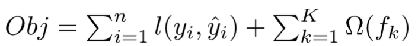
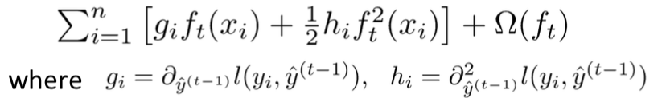
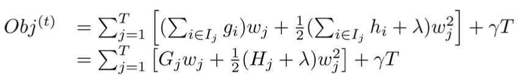
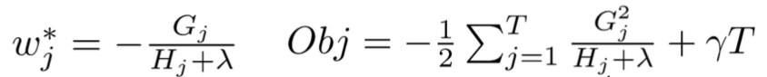

[*<<返回主页*](../index.md)  
**本文为作者原创，转载请注明出处** 
### XGBoost分类器原理及应用实战
本文结合作者对xgboost原理的理解及使用xgboost做分类问题的经验，讲解xgboost在分类问题中的应用。内容主要包括xgboost原理简述、xgboost_classifer代码、xgboost使用心得和几个有深度的问题 
#### XGBoost原理简述
xgboost并没有提出一种新的机器学习算法，而是基于现有的GBDT/lambdaMART等tree boosting算法在系统及算法层面（主要是系统层面）进行了改进；系统层面改进点包括：带权重的分位点分割算法(weighted quantile sketch)、稀疏特征的处理(sparsity-aware splitting)、缓存(cache-aware access)、out-of-core computation、特征并行、基于rabit的分布式训练等，这些改进使得xgboost无论是在单机训练还是分布式训练上的耗时都比pGBRT/scikit-learn/spark MLLib/R gbm等有至少几倍的提升；算法层面的改进主要包括：L1/L2正则化、目标函数二阶导的应用等；  
boosting基本思想是叠加多个弱分类器的结果组合成一个强分类器，叠加方法是各个基分类器的结果做加法，在生成下一个基分类器的时候，目标是拟合历史分类器结果之和与label之间的残差，预测的时候是将每个基分类器结果相加；每个基分类器都是弱分类器，目前xgboost主要支持的基分类器有CART回归树、线性分类器；  
##### CART回归树
CART(Classification And Regression Tree)回归树，顾名思义，是一个回归模型，同[C4.5](https://zh.wikipedia.org/wiki/C4.5%E7%AE%97%E6%B3%95)分类树一样，均是二叉树模型；父节点包含所有的样本，每次分裂的时候将父节点的样本划分到左子树和右子树中，划分的原则是找到最优特征的最优划分点使得目标函数最小，CART回归树的目标函数是平方误差，而C4.5的目标函数是信息增益（划分后的信息增益最大）；
对CART回归树来说，孩子节点中样本的预测值是所有样本label的平均值（why？因为CART的目标函数是平方误差，使得平方误差最小的预测值就是平均值，可以证明一下），
而C4.5决策树中孩子节点的预测值一般采用投票法；在构建树的时候，两者都采用贪心算法，即每次节点分裂时找本次所有分裂点中目标函数最小的分裂点，该方法不一定能找到全局最优的树结构，但能有效的降低计算量； 
##### XGBoost
多数情况下，xgboost将CART回归树作为基分类器（tree-based booster）；xgboost不断生成新的CART回归树，每生成一颗树即是在学习一个新的函数，这个函数将每个样本映射到唯一确定的一个叶子节点中，同一叶子节点中的所有样本共享相同的预测值，函数的目标则是去拟合所有叶子节点中样本的历史残差；损失函数可以是与CART回归树相同的均方误差，也可以是交叉熵（一般用于分类问题中）或各种rank loss（用于rank问题中）；  
xgboost的目标函数可以表示如下：  
  
其中第一项是训练损失（平方误差、交叉熵等），第二项是正则化损失（L1、L2等）；为了便于计算，对上式进行泰勒展开，并取0/1/2阶项作为目标函数的近似表示：  
  
将正则化项（L1和L2正则化项均不为0，其系数分别为gamma和lambda）带入上式，并进一步化简（将各个叶子节点中样本合并）得到如下： 
  
不难发现，这个函数是关于叶子节点权重wj的二次函数，其最值点和最值分别为：  
  
这样近似及化简之后，针对每个候选划分能快速计算其孩子节点的预测值和目标函数值，构建树的时候同样使用了贪心算法；  
更详细的推导请参考[XGBoost: A Scalable Tree Boosting System](https://arxiv.org/pdf/1603.02754v1.pdf)和tianqi的ppt;  
#### xgboost_classifer代码
代码地址：[https://github.com/suvedo/xgboost_classifier](https://github.com/suvedo/xgboost_classifier) 
##### 线下训练
首先按照[xgboost官方教程](https://xgboost.readthedocs.io/en/latest/build.html) clone源码，并安装python包。（不详述）  
配置train_dir/config.py中的参数，包括：1）XGBoostConifg中的与xgboost模型相关的参数（参数含义详见下文的调参心得)；2）Config中的与输入输出及其它训练相关的参数；  
配置完参数后运行sh run.sh即可训练、验证并测试模型，程序会保存训练好的模型，将训练好的模型拷贝到deploy/c++目录下即可在线预测  
##### 在线预测
deploy/c++目录下运行make编译代码，然后运行./test_xgb_cls即可运行预测demo，预测之前先配置conf/xgb_cls.conf，包括模型路径、特征维度、树数量；若要把在线预测代码集成在自己的代码中，只需要拷贝 include/, lib/, xgboost_classifier.h, xgboost_classifier.cpp即可  
#### XGBoost使用心得
##### 调参心得
booster：指明使用的基分类器，默认为gbtree，还可以选择gblinear和dart。gbtree则表示CART树，gblinear表示线性分类器，dart也是使用CART作为基分类器，只不过对各个CART树使用类似于nn里的drop-out，可以配置rate_drop来指明drop-out的比例；一般情况下，都使用默认的gbtree;  
eta：收缩因子，或者学习率，每颗树的结果乘以eta为样本在这颗树的最终得分，eta一般小于1，eta越小，后续基分类器的学习空间就更大，同时也可以避免过拟合，如果发现树的颗树比较少，可以适当调低eta；默认值为0.3；  
gamma：参数中的gamma不是公式中的L1正则化系数（L1正则化系数对应的参数为alpha），而是最小的分类损失降低(loss reduction)，只有当节点分裂带来的损失降低大于gamma时才进行分裂，可以有效避免过拟合；默认值为0，**注意**：因为有正则化项的存在（特别是L1正则化），分裂节点不一定能带来正向的损失减小，所以gamma为0不一定表示所有的分裂均满足要求（均能分裂）；  
max_depth：树的最大深度，这个比较好理解；默认值为6，如果过拟合严重，可以适当减小该参数值；  
subsample：生成下一颗树时训练样本的采样率(row subsampling)，类似随机森林，默认为1，如果样本数量比较大或者过拟合严重，可以考虑减小该参数值；  
colsample_bytree：生成每一颗树时对特征的采样率(column subsampling)，类似随机森林，默认为1；  
colsample_bylevel：生成每一层时特征的采用率，在每颗树的特征的基础上采样，colsample_bytree\*colsample_bylevel，默认值为1  
colsample_bynode：节点分裂时特征的采样率，在每颗树、每层的基础上采样，colsample_bytree\*colsample_bylevel\*colsample_bynode，默认值为1  
lambda：叶子节点输出值的L2正则化系数，默认为1  
alpha：叶子节点输出值的L1正则化系数，默认为0，即不做L1正则化系数  
tree_method：构建树算法，候选值有exact、approx、hist、auto等，exact代表论文中的Basic Exact greedy algorithm，即每次生成孩子节点时遍历所有的特征的所有可能的分裂点，从而找到最优分裂点；approx表示带权的分位点分割算法，由（泰勒展开后的）损失函数可以推导出每个样本的损失是带权的平方误差，其权重为样本的二阶导数，而分位点算法是为了节省计算时间而提出的近似计算方法，将样本划分到多个bucket中，各个bucket之间有序，但bucket中的元素不需要有序，划分点就是每个bucket中最大值，使用分位点算法可以将候选划分点减小至m个（m表示bucket的个数），生成bucket的时候每个样本都是有权重的，权重为二阶导数；hist表示基于bin strategy的近似算法，具体原理还有待研究；auto表示根据数据量自动选择tree_method，数据量小时选择exact，数据量大时选择approx；  
sketch_eps：当tree_method=approx时用于指明近似误差的大小，一般可以认为最终的bucket个数为O(1 / sketch_eps)，因此sketch_eps越小，approx越接近exact；  
objective：目标函数，默认为reg:squarederror，即平方误差；可以取binary:logistic/multi:softmax/rank:pairwise等；我在最先调参的时候使用reg:squarederror，而线上的xgboost版本比较老旧，不支持此目标函数，因此只能换成binary:logistic重新训练，换成binary:logistic并且early-stop的eval_metric选用auc反倒效果变好，分析原因为：我的任务中正负例样本比例悬殊比较大，使用rmse、error等对正负例敏感的eval_metric反倒效果不好，auc的含义及计算方法见[机器学习一般流程总结](../NLP/3_ml_process.md)；  
base_score：样本的初始得分，相当于全局偏置，默认值为0.5；  
eval_metric：验证集的metric，在训练的日志中能看到train和eval的metric；候选值有rmse（均方误差根）、error（分类错误率）、auc、ndcg等；根据目标函数的不同设置默认值；  
enable_early_stop：是否使用early-stop，一般都需要使用验证集做训练时的验证和早停避免过拟合，也可以通过早停的情况了解自己的模型是否过拟合了；如果在xgb.train()的参数中指名了使用早停，则必须要指定evals列表；  
early_stopping_rounds：eval_metric在early_stopping_rounds轮没有增加或减少则停止训练，一般设置为10轮；  
##### XGBoost有哪些优点
我一开始使用nn做分类问题，nn比较擅长特征抽取，而我的任务的特征基本上是抽取好的，不需要nn的特征抽取能力，且nn训练慢，必须依赖gpu（公司内部训练工具导致），任务排队现象严重，效果低下；后来选用xgboost，训练速度极快，内存友好，且不依赖gpu，效果与nn基本持平；另外还有一点xgboost可以计算每个特征的重要性（get_fscore()或get_score()接口），这对于特征筛选、模型可解释性、模型透明、模型调优等都有好处；计算特征的重要性的原理：通过指明的important_type计算，比如important_type=weight时，则重要性就是该特征被用于节点分裂的次数，important_type=gain时就是特征分裂带来的平均收益，important_type=cover时就是每个节点中的所有样本的hessian值之后；xgboost还可以以明文的形式保存树模型，方便模型可视化和调优；xgboost不需要对特征做normalization；  
#### 几个有深度的问题
问题一：xgboost模型的参数是什么？  
答：每颗树的树结构：针对非叶子节点则是其分裂特征及分裂点，针对叶子节点，则是其得分或者权重；或者理解成一个函数集合（参考线性booster）；  
问题二：gradient boosting tree中的梯度怎么理解？  
答：xgboost的损失函数利用泰勒展开近似，对当前树（或函数）在0处求了一阶梯度和二阶梯度，由于是在0处求梯度，所以本质上是损失函数对历史基分类器和的梯度；如果是MART或者GBDT等tree boosting模型，其只使用一阶导近似，则可以得出当前树的目标就是拟合历史残差的梯度，而每颗树存在一个收缩因子eta，因此每颗树的贡献其实是eta \* grad，这跟nn等模型中使用的sgd等优化算法有异曲同工之妙：sgd计算每轮的loss及其梯度，对应到boosting方法中则是每颗树的残差及其梯度，sgd的学习率则对应boosting的收缩因子，从这个角度看，boosting本质上也是利用梯度下降的方法一步步的逼近训练样本的真实值，从而达到模型训练的目的，而sgd优化方法也可以利用xgboost中的泰勒展开去理解，也可以使用loss的二阶导，目前一些更先进的基于梯度的优化方法或自适应学习率的优化方法已经引入了二阶导；  
问题三：base_score有什么作用？  
答：base_score永远存在，因为在生成第一颗树的时候也要使用历史分类器的和来计算损失和梯度，如果不指明，则表示历史分类器和为0；在对第一颗树的损失函数近似时，当前树节点的score如果越接近0，近似效果越好，因此可以选用一个base_score使得第一颗树的score尽量接近0，对于二分类问题（label为0和1），0.5是较好的选择（因为样本残差为-0.5或0.5），我猜测这也是为什么base_score的默认值是0.5的原因；  
问题四：特征分裂点怎么找的？类别特征怎么处理？  
答：针对连续特征值，划分点分别取所有的值（可以事先将特征值排好序），采用每个特征值进行划分，详见tree_method参数的解释；类别特征要转化为one-hot encoding，之后的划分方法与连续特征无两样；  
问题五：孩子节点的值计算都是平均值吗？还是针对不同的loss有不同的计算方法？  
答：孩子节点的取值目标是使得损失函数最小，如果损失函数是平方误差，由于平方误差的三阶导为0，因此泰勒展开近似后与原损失函数一样（即没有任何近似），此时孩子节点的值就是平均值；如果针对不同的loss，则是根据泰勒展开近似后得到二次函数（与平方误差一样），然后根据二次函数的最值点得到孩子节点的值；  
问题六：利用泰勒展开做近似有什么作用？会对结果有多大程度的影响？  
答：首先考虑不使用泰勒展开近似时，针对每个候选分裂点，都需要计算所有样本的损失，损失函数计算量大，更要命的是孩子节点的score怎么选，针对某些损失函数是否要遍历所有可能的值，遍历的话计算量可想而知，不遍历该如何保证精度，是否也需要使用近似；而使用泰勒展开近似后，将历史分类器的结果（梯度部分）与当前结果ft(x)分开，损失函数变成了关于两个孩子节点的二次函数，针对二次函数求最值，再简单不过了，在工程上也可以并行处理，针对不同的损失函数也可以很好的实现；至于对结果的影响有多大，取决于高阶梯度和ft(x)有多接近0，越接近近似效果越好，就算是近似效果不好，由于是多个分类器结果的叠加，影响面也不至于很大，而模型训练时本身就要使用各种手段防止过拟合，近似是否也有防止过拟合的效果呢；并且，基于问题二的分析，训练是不断逼近样本真实值的过程，引入收缩因子，可以将泰勒高阶项的影响进一步减小，尽量保证训练是按照正确的方向在进行（负梯度的方向）；  
问题七：xgboost如何并行？  
答：xgboost的并行是在求特征分裂点时的并行，在泰勒展开近似后，损失函数的结构特别清晰明确，历史梯度只需要求一次，所有分裂点共享，不同特征的分裂点之间完全独立，完全可以并行；可以事先针对每个特征对所有样本排个序，在分裂的时候能快速找到分裂点前后的样本并计算历史梯度和；具体实现的时候csc格式的block存储有序的特征；  
#### 参考文献
[xgboost官方教程](https://xgboost.readthedocs.io/en/latest/index.html)  
[一文读懂机器学习大杀器XGBoost原理](https://zhuanlan.zhihu.com/p/40129825)  
[XGBoost: A Scalable Tree Boosting System](https://arxiv.org/pdf/1603.02754v1.pdf)  
[xgboost之分位点算法](http://datavalley.github.io/2017/09/11/xgboost%E6%BA%90%E7%A0%81%E4%B9%8B%E5%88%86%E4%BD%8D%E7%82%B9)
