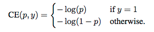
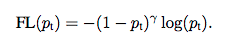
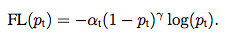
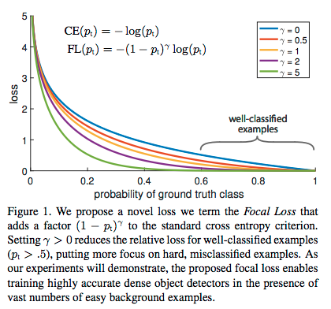

[*<<返回主页*](../index.md) 
### 正负例样本失衡及focal loss
前段时间在解决分类任务时，发现当正负例比例相差较大时，分类算法更倾向于优化比例较大的类别的loss，最终导致正负例上的正确率有极大悬殊（正例正确率远低于负例）。  
这其实是做分类任务时经常遇到的问题，即正负例比例不均衡，解决此类问题的办法除了较常用的over-samping/under-sampling之外，还有一类方法是修改loss函数，使其能更均衡的去学习正负样本。  
比较容易想到的方法是直接对正负样本的loss加上不同的权重，比如正样本loss的权重为alpha，负样本的权重为(1 - alpha)，在我看来，这种方法本质上和over-sampling/under-sampling没有区别，针对的是所有的正样本或者所有的负样本去调整weight，粒度显得略大，因为有些正样本或者负样本是被正确分类的，它们的loss不应该被放大。  
于是，何恺明大神在[Focal Loss for Dense Object Detection](https://arxiv.org/abs/1708.02002)这篇论文中提出使用focal loss替换分类问题中常用的cross entropy loss，有效的解决了正负例样本失衡问题。  
正常的ce loss为： 
  
从上式可以看出，正样本的loss为-log\(p\)，即p越小，loss越大，同理，对负样本，p越大，loss越大；但在正负例比例有较大悬殊的时候，使用ce loss模型依然不能很好的学习（如本文开头所言），此时需要去更加强化那些不容易分对的样本的loss，而去弱化那些分类正确的样本，因此一个比较自然的想法就是用残差去对loss做一个进一步的加强或者减弱，于是便有了focal loss(下式为正例loss，负例loss可参考 [何恺明大神的「Focal Loss」，如何更好地理解？](https://zhuanlan.zhihu.com/p/32423092))： 
  
focal loss中，(1-Pt)是残差（对负例而言残差就是Pt），gamma是超参数，当残差(1 - Pt)或Pt较大时，说明该样本不容易被正确分类，所以相应的loss做一个(1 - Pt)gamma的加强，乘以一个权重(1 - Pt)gamma，（负例样本的权重为 Ptgamma），这样便能使得模型更加重视不容易分对的那部分样本，一定程度上去平衡类别不均衡的问题。  
在我看来focal loss就是在ce loss的基础上增加了一个类似于均方误差(MSE)的loss，只不过这个地方的gamma不是固定的2，用这个类似于均方误差的loss对原本的ce loss做了一个加强或者减弱。  
回到本文刚开始提到的正负例准确率悬殊的问题，focal loss是否解决了这个问题呢？答案是肯定的，因为当在loss中多加入(1 - Pt)gamma或者Ptgamma这一项时，模型不再一味的去减小那些容易优化的负例样本的loss，而是去减小那些难以优化的正例的loss，因为这些正例的focal loss远大于那些负例。但是，focal loss本质上并不是去针对正负样本不均衡问题优化的，而是针对正确分类的困难与否优化的，只是正负例比例失衡恰好有这个问题，为了更大程度的去平衡正负例loss，可以在上述focal loss的基础上再对正负例loss加一个不同的权重： 
  
  
#### FAQ
1. 有人可能会问Pt在(0, 1)之间，无论是(1 - Pt)gamma还是Ptgamma都是在(0, 1)之间的，这样对loss永远是在减弱，并没有增强啊？
其实这里要看的不是绝对的增强或者减弱，因为loss的绝对值本身就没有意义，这里要看的是相对的增强/减弱，如果对容易分错的样本的减弱比不容易分错的样本的减弱要小，则这个loss就是有效的；又因为多项式函数(y = xgamma)是递增函数，所以只要残差(1 - Pt或者Pt)越大，权重就会越大，因此对残差更大的样本减弱得更少，以此达到重视难分样本的目的。  
2. 超参数gamma和alpha的选择？他们跟正负例比例有何关系？
参考paper中的曲线，gamma越大，loss越陡，对错误分类的样本的权重增强效果就越明显，因此越强调错误分类的样本（或越弱化正确分类的样本），则gamma应该越大，gamma与正负例比例并没有本质上的关系。如果只调整gamma并不能解决正负例准确率失衡的问题，则需要调节alpha的值，正例比例越小，alpha越大。  
  
  
#### 参考文献
+ [Focal Loss for Dense Object Detection](https://arxiv.org/abs/1708.02002)
+ [Focal Loss](https://blog.csdn.net/u014380165/article/details/77019084)
+ [何恺明大神的「Focal Loss」，如何更好地理解？](https://zhuanlan.zhihu.com/p/32423092)
